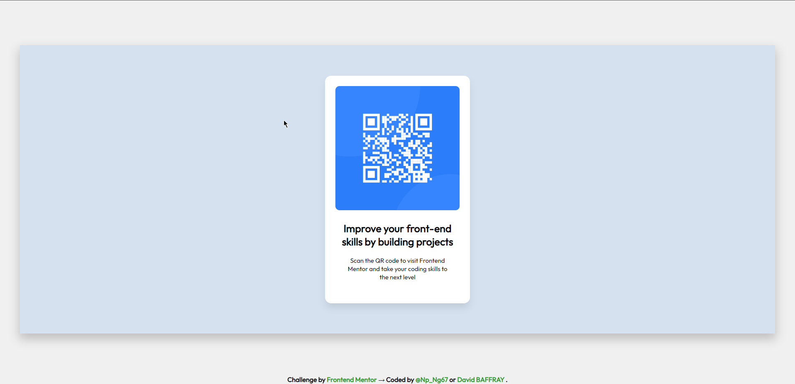

# Frontend Mentor - QR code component solution

This is a solution to the [QR code component challenge on Frontend Mentor](https://www.frontendmentor.io/challenges/qr-code-component-iux_sIO_H). Frontend Mentor challenges help you improve your coding skills by building realistic projects. 

## Table of contents

- [Overview](#overview)
  - [Screenshot](#screenshot)
  - [Links](#links)
- [My process](#my-process)
  - [Built with](#built-with)
  - [Useful resources](#useful-resources)
- [Author](#author)

**Note: Delete this note and update the table of contents based on what sections you keep.**

## Overview

### Screenshot

### Links

- Solution URL: [Github](https://github.com/David-BAFFRAY/-FeM--01----QR-Code-component)
- Live Site URL: [Add live site URL here](https://your-live-site-url.com)

## My process

### Built with

- Semantic HTML5 markup
- CSS custom properties
- Flexbox
- Mobile-first workflow

### Useful resources

- [MDN](https://developer.mozilla.org/fr/docs/Web/CSS/Media_Queries/Using_media_queries) - This helped me for media queries
- [CSS-Tricks](https://css-tricks.com/snippets/css/a-guide-to-flexbox/) - It helped me to use flexbox.

## Author

- Website - My website is under construction.
- Frontend Mentor - [@David-BAFFRAY](https://www.frontendmentor.io/profile/David-BAFFRAY)
- Twitter - [@Np_Ng67](https://twitter.com/Np_Ng67)
- Linkedin - [David BAFFRAY](https://www.linkedin.com/in/david-baffray-189b6422b/)
